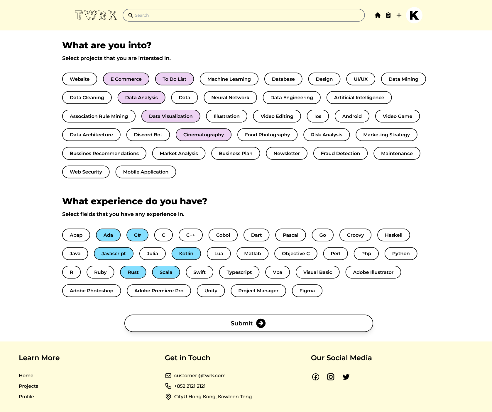

# CityHack22 Project Submission
## Project: Together We Work - TWRK

## Team: Team Anagata
## Members
- Enryl Einhard (Leader)
- Verena Andrea Wibisono
- Keane Dylan Yennoto
- Benedict Ronaldo Gustaf
- Stefan Rafael Muljadi

## Description of the Project (300 words)
TWRK: Together We Work is a website platform that provides a matchmaking service for selecting group mates in any situation needed, whether for personal projects or group competitions.  We try to solve the problem of online learning where it is hard to connect with people and find people who share the same interest and skillsets needed when doing a group project. Therefore we come in an all-in-one platform to solve your group project needs. We highlight the user-friendly interface and match-making process using machine learning that pairs people of similar interest/skills needed to create a group together for a project. TWRK can be easily adopted into various educational institutions, eliminating the hassle of choosing members for course group projects and competitions. The TWRK recommender system is also highly suitable for scholars, connecting research from worldwide with similar projects topics or fields needed to support a study. 
The match-making process uses a content-based approach recommender system. Therefore, the system of TWRK is not limited to software-related projects and is open to all fields and learning interests.

TWRK: Together We Work is made with Vue.js, GraphQL, MongoDB, and Python

## 3 Most Impactful Features of the Project (with Screenshot and Short Description (150 words))
## 1.Matchmaking between people and project

 
 

We use machine-learning based matchmaking to best suit our users’ interest and help them match with the projects. User’s data input about projects preference and user’s skills were collected through the initial personalization to be processed by a content-based recommender system.

## 2. Explore Page and Project Feed

 
 

To discover other users’ project, we provide a feed page where our user can browse through others’ work and find project inspirations.

## 3. Built-in Task Oriented Feature

 

Our website also provide a task-helper feature which is a to-do list where group members can use when doing the project. Upon completion of each task, members can utilize this feature to help them achieve progress on their work.

## Tech used (as many as required)
1. JavaScript
2. Python
3. GraphQL
4. Vue.js
5. Apollo Server
6. Express.js
7. MongoDB
8. Node.js
9. Tailwind CSS
10. Scikit-learn
11. fastAPI
12. Numpy
13. Pandas
14. Vercel

## Link
[Project Demo](https://youtu.be/psuA-HQeNwc)
